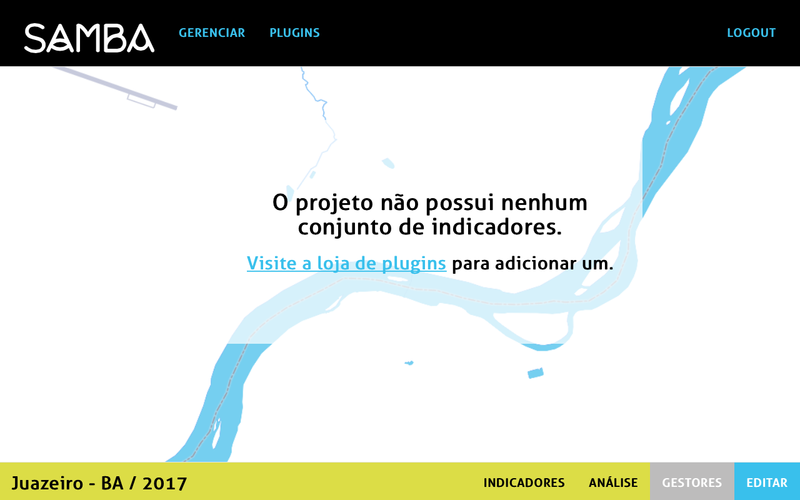
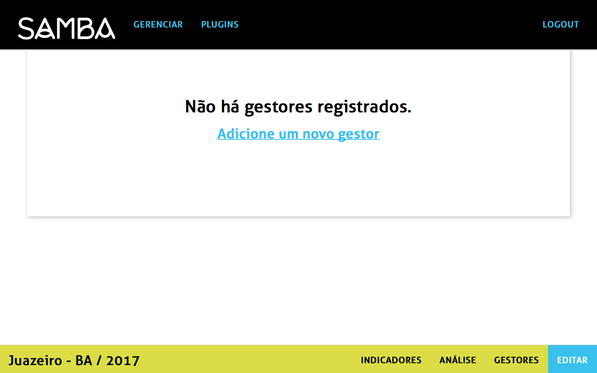
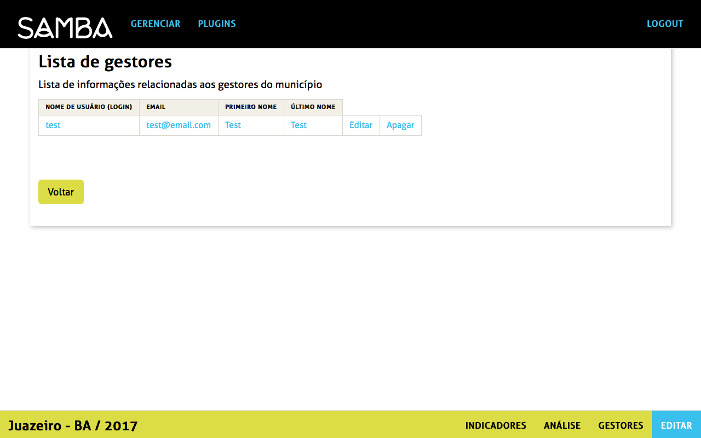

## Como adicionar um novo gestor para o projeto?

Uma vez que o novo projeto foi criado, é possível adicionar a ele um novo gestor. Na pagina do projeto criado clicar na parte gestor na parte direita da tela.

A página que se abre permite consultar a lista de gestores associados ao projeto. Pode inserir um novo gestor clicando no link _Adicione um novo gestor_.

Preencher o formulario seguinte com as informações requeridas e salvar.

Depois ter salvado o formulario aparece de novo a pagina dos gestores existentes.

