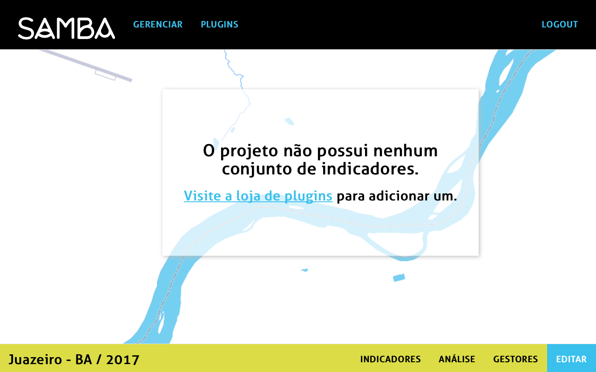
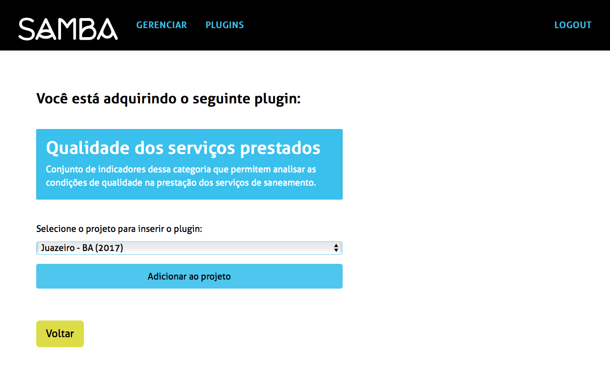

## Como adicionar um novo plugin?

Os plugins permitem armazenar as informações relativas aos serviços públicos de saneamento básico. Cada plugin contêm indicadores de análise que deveram ser preenchidos para elaborar o relatório final.
Na página inicial do projeto, visitar a **loja de plugins** para adicionar-los.

Na loja de plugins você pode escolher o que quer adicionar ao projeto. Por exemplo _Qualidade dos serviços prestados_.

Ao escolher o plugin, você deverá selecionar o projeto no qual quer adicionar-lo.

