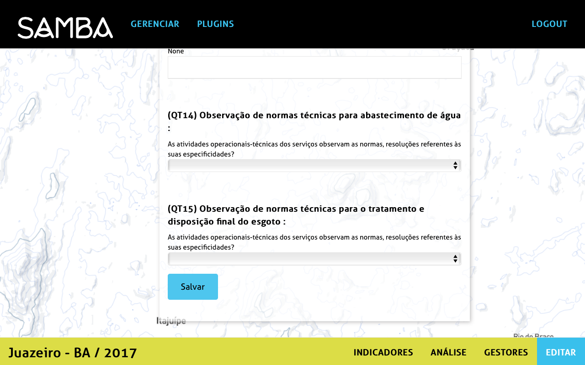

## Como editar um plugin?

Para editar um ou varios plugins já adicionados ao projeto e preencher os dados correspondentes, clicar no botão _Editar_. Aparecerá a página com os campos dos indicadores a preencher. Preencher e **Salvar** as informações.

Depois de ter salvado os dados, eles aparecerão numa tabela juntando todos os plugins e os valores associados.

