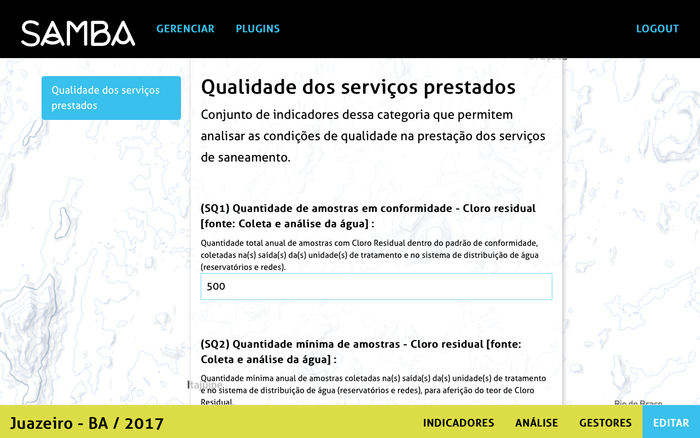

## Como editar um plugin?

Para editar um ou varios plugins já adicionados ao projeto e preencher os dados corespondentes, clicar no butão _Editar_. Aparece a pagina com os campos dos indicadores a preencher. 

Depois ter salvado os dados, eles aparecem numa tabela juntando todos os plugins e os valores associados.

