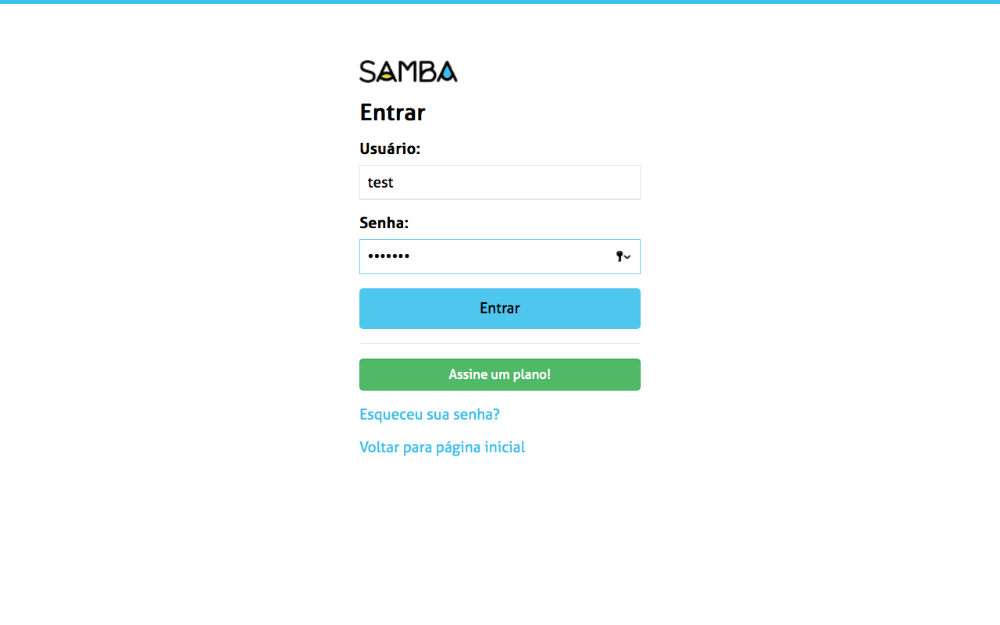
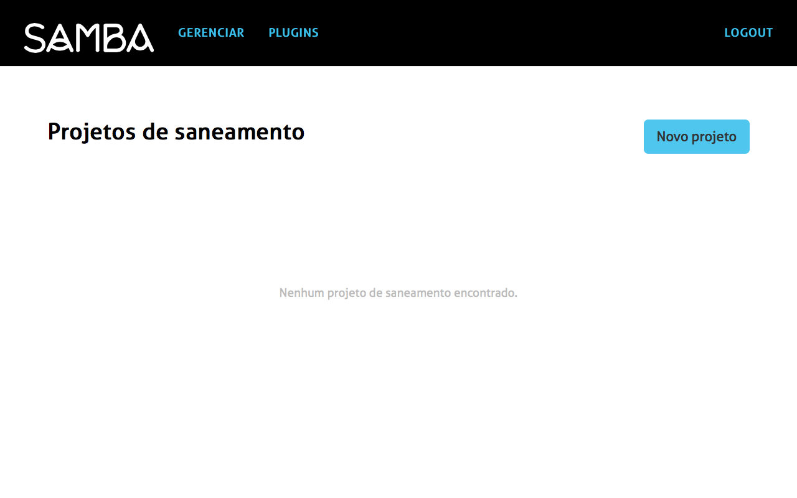
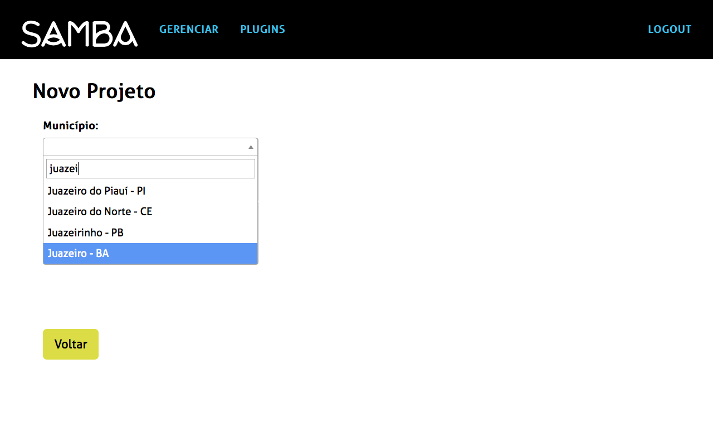

## Como criar um novo projeto?

Para criar um novo projeto e consultar os que já foram criados é necessario fazer seu login no site.

Ir na aba **Projetos** do Menu preto e appertar o botão **Novo Projeto**.

Escolher o município dentro da lista. Pode pesquisar o nome do munícipio escrevendo suas primeiras letras. 

Escolher o ano do projeto. Essa informação permite montar um historíco do municipío com os dados preenchidos.

Para concluir a criação, salvar o projeto.

